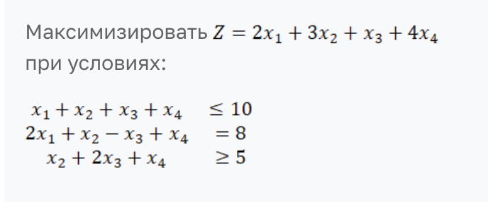
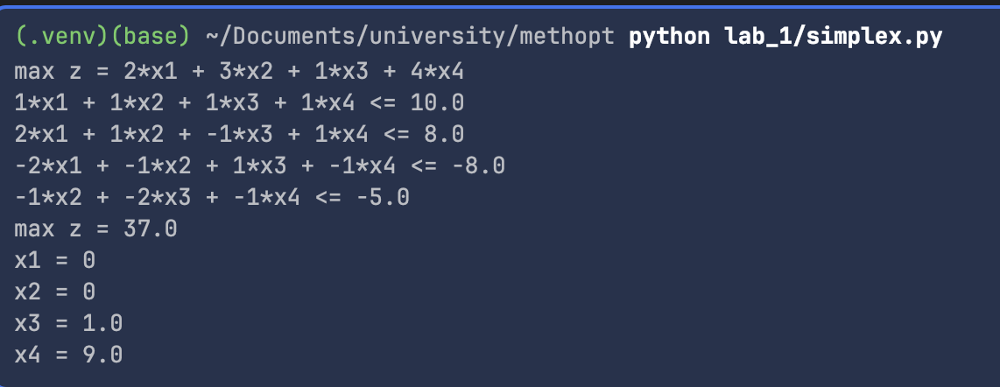
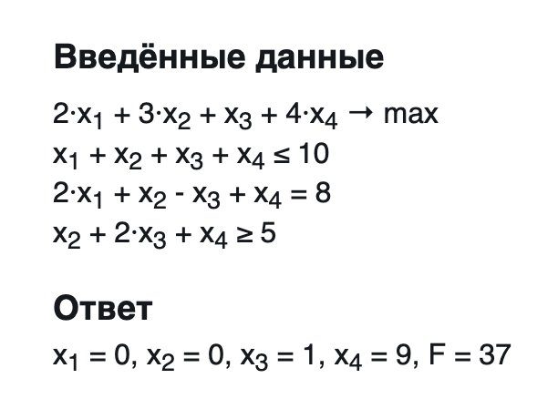

# Задание №1. Разработка программного обеспечения для решения задачи линейного программирования

---
#### Вариант 


#### Задание по теме «Решение задач линейного программирование»
В рамках данной работы вы закрепите навыки работы с математической постановкой задачи линейного программирования, получения из нее допустимого канонического вида и ее решения с помощью симплекс-метода. Также усилите компетенции в области математического программирования, когда будете реализовывать решение ЗЛП в языке программирования высокого уровня.

##### Что дано на входе?
Общая задача линейного программирования – математическая запись: целевая функция (он же критерий эффективности); ограничения.

#### Что необходимо сделать?
Необходимо реализовать компьютерную программу на языке высокого уровня (Python или эквивалентный), которая будет решать ЗЛП (полный цикл), выполняя следующие основные шаги:

1. Считывание текстового файла с файла с постановкой ЗЛП (формат файла - на ваше усмотрение).
2. Приведение задачу к каноническому виду.
3. Формирование вспомогательной задачи.
4. Решение вспомогательную задачу.
5. Переход к основной задаче (если есть возможность).
6. Решение основную задачу.
7. Запись ответа в форме: оптимальная точка, значение целевой функции в оптимальной точке: или информацию, что решений нет, указав причину.

#### Функционал 

- `read_data(filename)` считывает данные из файла 
- `canonization(table)` приводит к канонической форме 
- `simplex(func_coeffs, constraints, b_col, is_max)` основной расчет симплекс метода 
- `print_answer()` вывод результатов в понятной форме

#### Входные данные

- Формат: 
  - Первая строка: `min` или `max`
  - Вторая строка: коэффициенты при переменных в целевой функции через пробел 
  - Остальные строки: коэффициенты при уравнениях через пробел, знак(`<=`, `>=`, `=`), коэффициент справа
- Пример
    ```text
    max
    2 3 1 4
    1 1 1 1 <= 10
    2 1 -1 1 = 8
    0 1 2 1 >= 5
    ```

Чтение происходит из файла `data.txt`

##### Запуск программы 

- Правильно заполнить `data.txt` в той же директории, что и `simplex.py`
- `python simplex.py`


#### Запуск на моем варианте 
Запуск программы: 



Так же сравним с результатами в онлайн калькуляторе: 


Ответы совпадают. 

#### Выводы 

В процессе выполнения работы были подробно изучены принципы симплекс-метода и этапы решения задач линейного программирования. 
Особенно полезным было понимание того, как исходная задача преобразуется в каноническую форму и как формируется симплекс-таблица. 
Основная трудность заключалась в корректной обработке знаков ограничений и стабильной работе при преобразовании равенств и неравенств. 
Сравнение результатов с калькулятором подтвердило правильность алгоритма и дало уверенность в понимании теории. 
Работа оказалась полезной для закрепления навыков программирования и математического моделирования.