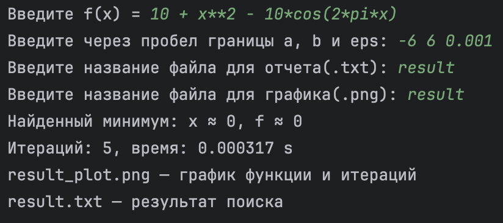
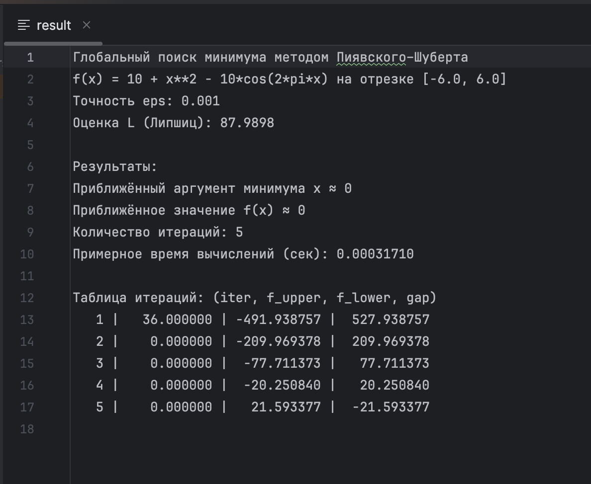

# Задание №2. Метод ломаных

### 1. Задание 
Разработайте программу на языке Python или подобном (C++, Java...), которая будет решать задачу поиска глобального экстремума для заданной функции на заданном отрезке.

На вход программа принимает строку одномерной функции, например f(x) = x + sin(3.14159*x) (она заведомо должна являться липшицевой), координаты концов отрезка (вещественные числа), точность вычисления eps (например, 0,01). На выходе она выполняет визуализацию графика исходной функции, вспомогательных функций (по возможности итоговой ломаной, на которой достигнута требуемая точность), приближенное значение аргумента и минимального значения функции, число пробовавшихся итераций, потраченной время.

### 2. Входные данные 

- В функции разрешается использовать следующие переменные:
  - `sin, cos, log, exp, sqrt, pi, tg`
- Для обозначения неизвестной используйте `x`
- На вход в программе на первой строке подается функция `f(x)`
  - Пример: `x + sin(pi*x)` (`f(x) = ` писать не надо)
- На второй строке через пробел подаются левая и правая границы отрезка, а также значение шага `eps`
- На третьей - название файла для отчета (`.txt`)
- На четвертой - название файла для графика (`.png`)

### 3. Выходные данные 

- отчет о работе алгоритма 
- визуализация 

### 4. Примеры 

### 5. Анализ результатов

Программа верно считает глобальный минимум даже при наличии нескольких локальных минимумов. 
Результаты совпадают с ожидаемыми для функции Растригина: 
минимум достигается при `x ≈ 0, f(x) ≈ 0`

