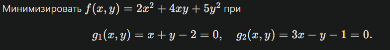
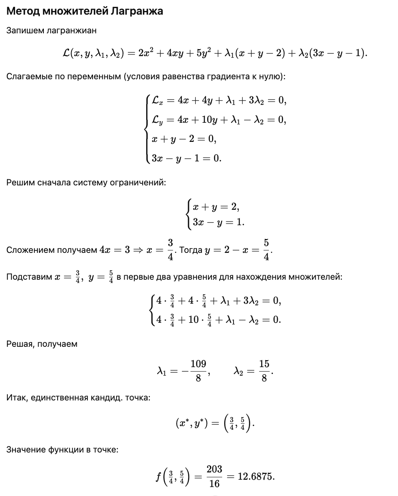
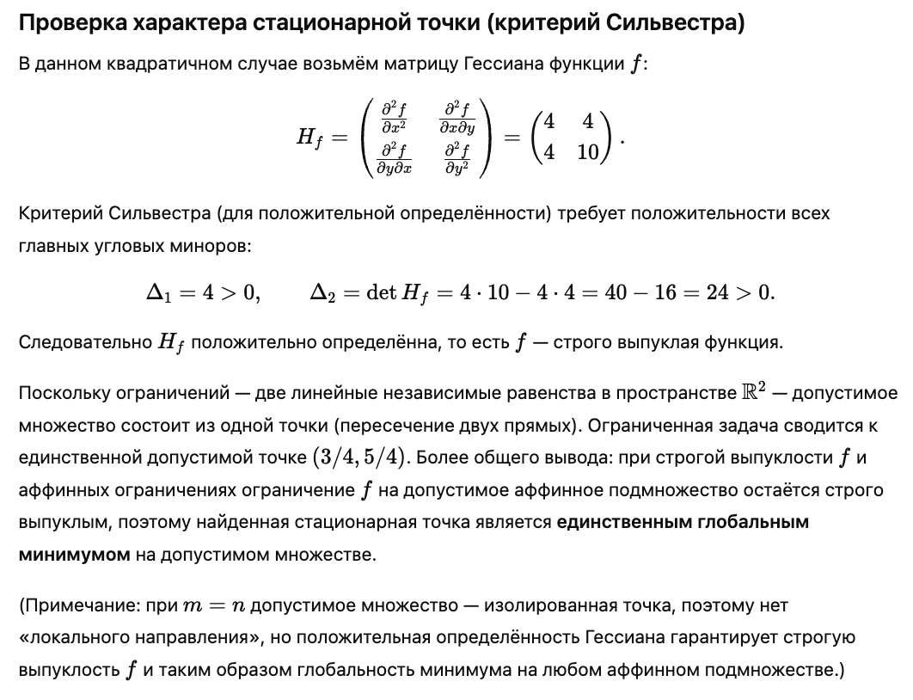
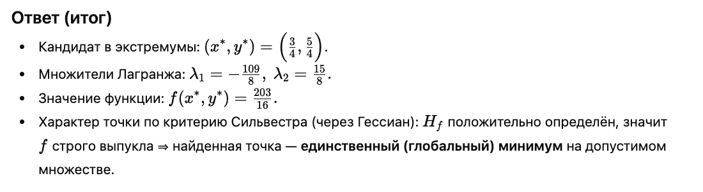
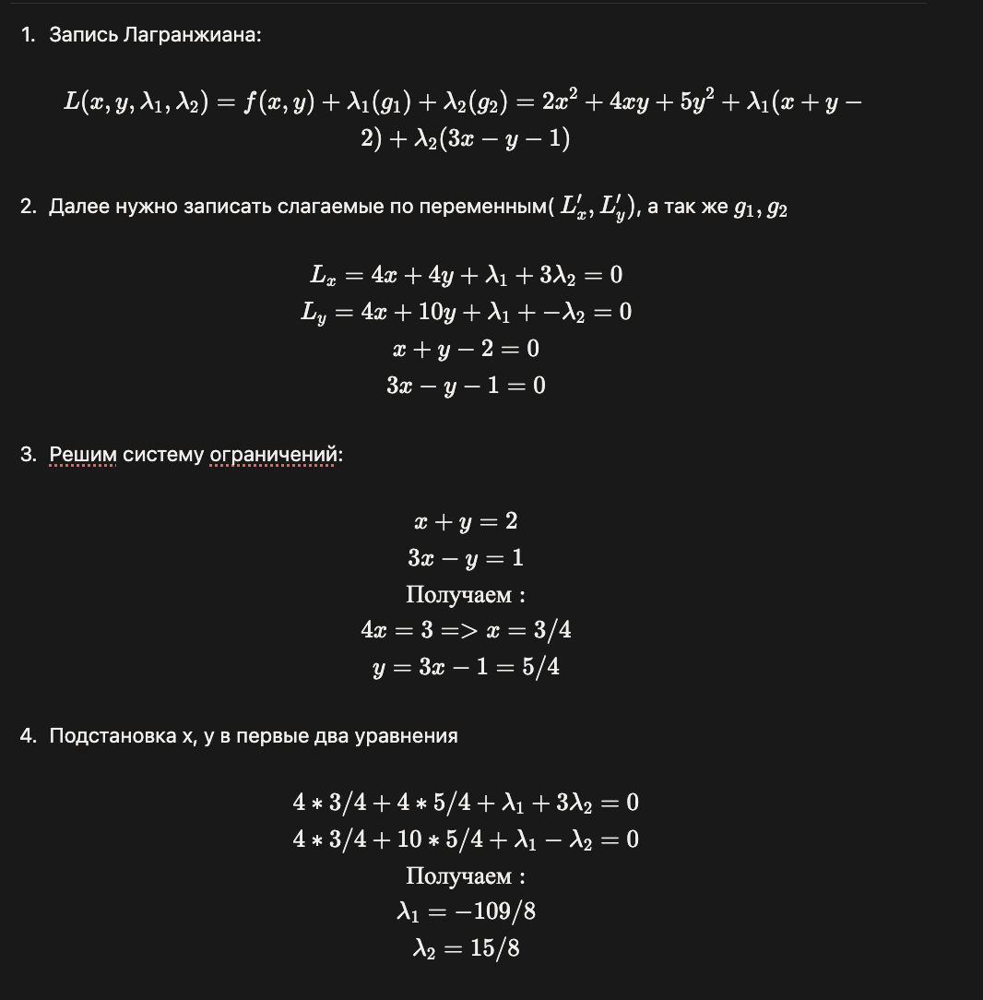
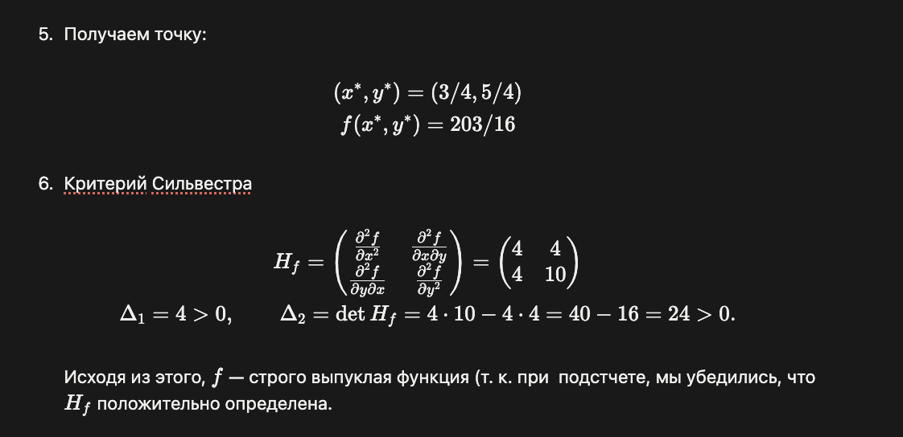

# Задание №3. Решение задачи условной выпуклой оптимизации с помощью метода множителей Лагранжа

## Вариант: 


```
Минимизировать $f(x,y)=2x^2+4xy+5y^2$ при
$$
g_1(x,y)=x+y-2=0,\quad g_2(x,y)=3x-y-1=0.
$$
```

## Решение GPT-5 thinking mini 





## Решение




## Анализ решений 

- Ответ получен одинаковый 
- gpt дает верные комментарии по ходу решения
- у gpt нет арифметических ошибок

## Вывод

Решение с помощью gpt полностью совпадает с моим самостоятельным решением.
Все шаги выполнены правильно и с комментариями, ошибок не обнаружено в решении gpt. 
Условие было корректно интерпретировано.