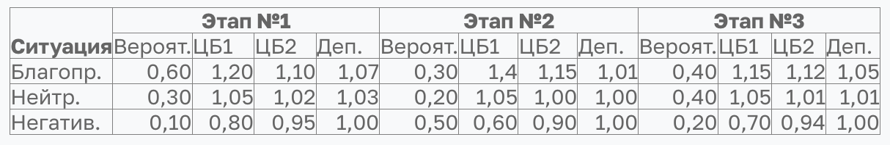
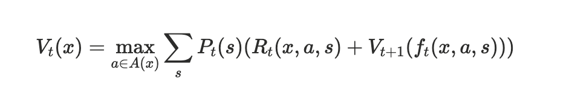
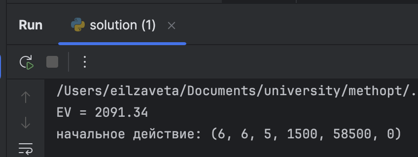

# Задание 4. Решение задачи динамического программирования

### Задача пошагового управления инвестиционным портфелем

### Описание задачи

К началу периода планирования у инвестора было два вида ценных бумаг (ЦБ) и депозиты (Деп.) на сумму 100, 800, 400 денежных единиц (д.е.) соответственно. В общих чертах говоря, Деп. – банковские вклады; при этом условия на все депозиты одинаковые. Также в инвестора есть свободные средства в размере 600 д.е. Excel версия данных находится в приложенном файле.

Период планирования разбит на три этапа. Для каждого этапа известны вероятности наступления ситуации, которая может быть «благоприятной», «нейтральной», «негативной» (обратите внимание, что вероятности событий в каждом этапе разные).

В зависимости от ситуации оценены изменения стоимости ценных бумаг и процентная ставка депозита. Данные приведены в таблице. Например, на первом этапе при реализации негативной ситуации (ее вероятность равна 0,1 или 10%) курс ЦБ1 понизится на 20%, а Деп. не будет иметь дохода (коэффициент равен единице); или на этапе №2 при благоприятной ситуации (вероятность – 30%) ЦБ2 повысится на 15%, а Деп. даст доход в один процент; при нейтральной ситуации в третьем этапе (вероятность – 40%) – депозит даст доход один процент от суммы за один период.



Шаговым управлением является изменение объема фондов ценных бумаг и(или) депозитов на один или несколько пакетов одну четверть от первоначальной стоимости. Например, перед первым этапом инвестор может купить ЦБ1 в объеме 25 д.е. или продать депозиты в объеме 100 д.е. При увеличении объемов ценных бумаг и депозитов инвестор не может брать кредит, а распоряжаться только свободными средствами.

Требуется разработать такой план управления закупками/продажами ценных бумаг и депозитов, чтобы суммарный объем дохода был максимальным. Поскольку в задаче присутствуют вероятности, то для оценки дохода необходимо использовать критерии принятия решений в условиях неопределенности (при программной реализации Вы можете выбрать один из них, например, критерий Байеса).


### Задания 
1) составить математическую постановку задачи, выписать рекуррентное соотношение Беллмана, составить и оформить алгоритм решения задачи (за выполнение без замечаний дается 0,6 от максимальной величины балла); 
2) кроме выполнения первого задания выполнить программную реализацию метода и определить наилучшее управление и максимальный доход; критерия принятия решений выбирает пользователь (за выполнение всего задания без замечаний дается до 5 баллов;


### Общая математическая формулировка
- 3 этапа: t = 1, 2, 3
- В начале каждого этапа есть состояние `S_t` и принимающееся решение `q_t` из множества доступных состояний 
- Реализуется случайный сценарий `s` из `S_t` с вероятностью `p_t(s)`, который переводит в следующее состояние `S_(t+1)`
- Функция перехода `S_(t+1) = f_t(S_t, a, s)`

### Рекуррентное соотношение Беллмана 
- `V_t` - максимальное ожидаемое вознаградение на этапе `t` в состоянии `x`
- `A_t(x)` - множество возможных действий на этапе `t`
- `P_t(s)` - вероятность сценария `s` на этапе `t`
- `f_t(x, a, s)` - функция перехода между состояниями 
- `R_t(x, a, s)` - "награда" на этапе `t` при переходе 
- `V_(t+1)(x) = R_t(x)` - конечный пункт


Код представлен в файле `solution.py`

```python
def V(i, n1, n2, nd, cash_c):
    if i >= T:
        total_c = n1 * u1 + n2 * u2 + nd * ud + cash_c
        return total_c, None

    # общая текущая сумма
    total = n1 * u1 + n2 * u2 + nd * ud + cash_c
    max_n1 = min(total // u1 + 1, max_n1_limit)
    max_n2 = min(total // u2 + 1, max_n2_limit)
    max_nd = min(total // ud + 1, max_nd_limit)

    # лимиты продаж
    max_sell_n1, max_sell_n2, max_sell_nd = n1, n2, nd

    # максимальные покупки (потенциальные)
    l_1 = int(max(-max_sell_n1, -search_radius))
    r_1 = int(min(max_n1 - n1, search_radius))

    l_2 = int(max(-max_sell_n2, -search_radius))
    r_2 = int(min(max_n2 - n2, search_radius))

    l_3 = int(max(-max_sell_nd, -search_radius))
    r_3 = int(min(max_nd - nd, search_radius))


    best_EV, best_action = 0, None
    for j in range(l_1, r_1 + 1):
        n1_update = n1 + j
        if n1_update < 0 or n1_update > max_n1_limit:
            continue

        for k in range(l_2, r_2 + 1):
            n2_update = n2 + k
            if n2_update < 0 or n2_update > max_n2_limit or abs(j) + abs(k) > max_package_changes:
                continue

            for l in range(l_3, r_3 + 1):
                if abs(j) + abs(k) + abs(l) > max_package_changes:
                    continue

                nd_update = nd + l
                if nd_update < 0 or nd_update > max_nd_limit:
                    continue

                # стоимость покупок и выручку от продаж
                buy, sell = 0, 0
                if j < 0:
                    sell += round(j * u1 * (c1 - 1))
                elif j > 0:
                    buy += round(j * u1 * (1 + c1))

                if k < 0:
                    sell += round(k * u2 * (c2 - 1))
                elif k > 0:
                    buy += round(k * u2 * (1 + c2))

                if l < 0:
                    sell += round(l * ud * (cd - 1))
                elif l > 0:
                    buy += round(l * ud * (1 + cd))

                update_cash = cash_c - buy + sell

                if update_cash < 0:
                    continue

                EV_acc = 0
                for s in stages[i]:
                    h1 = n1_update * u1 * s[1]
                    h2 = n2_update * u2 * s[2]
                    hd = nd_update * ud * s[3]

                    next_n1 = h1 // u1
                    next_n2 = h2 // u2
                    next_nd = hd // ud

                    rem_1 = round(h1 - next_n1 * u1)
                    rem_2 = round(h2 - next_n2 * u2)
                    rem_d = round(hd - next_nd * ud)

                    next_cash = update_cash + rem_1 + rem_2 + rem_d

                    val_next, _ = V(i + 1, next_n1, next_n2, next_nd, next_cash)
                    EV_acc += s[0] * val_next

                if EV_acc > best_EV:
                    best_EV = EV_acc
                    best_action = n1_update, n2_update, nd_update, update_cash, buy, sell

    return best_EV, best_action


u1, u2, ud = 25, 200, 100
c1, c2, cd = 0.04, 0.07, 0.05
u1 = u1 * 100
u2 = u2 * 100
ud = ud * 100
stages = [
    [(0.60, 1.20, 1.10, 1.07), (0.30, 1.05, 1.02, 1.03), (0.10, 0.80, 0.95, 1.00)],
    [(0.30, 1.40, 1.15, 1.01), (0.50, 1.05, 1.01, 1.00), (0.20, 0.60, 0.90, 1.00)],
    [(0.40, 1.15, 1.12, 1.05), (0.40, 1.05, 1.01, 1.01), (0.20, 0.70, 0.94, 1.00)]
]

n1_0 = 100 // 25
n2_0 = 800 // 200
nd_0 = 400 // 100
cash0 = 60000

T = 3
search_radius = 2
max_package_changes = 5

max_n1_limit = 100
max_n2_limit = 40
max_nd_limit = 50
ev_c, action = V(0, n1_0, n2_0, nd_0, cash0)
ev = ev_c / 100
print(f"EV = {ev:.2f}")
print("начальное действие:", action)
```

Результат работы программы: 




### Выводы 
В ходе работы были освоен метод динамического программирования на примере задачи оптимизации расчёта стоимости пакетов для покупки/продажи активов.
Задача была переформулирована в математическую модель, выведено рекуррентное уравнение Беллмана и реализован алгоритм на Python.
